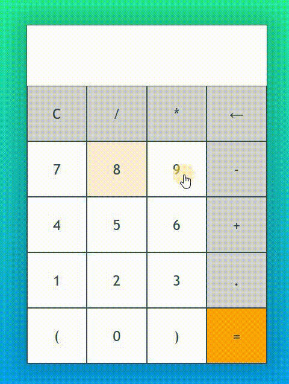

# 🛠 JS - Calculator

# 🔗 [Live Preview](https://super-gumdrop-dcf46b.netlify.app/)

## Welcome! 👋

- In this project I make a functional calculator in JS. First I create an array from all the elements with class name "button". Then I map throught all of them and add click event listener. Using switch statements I say that I want nothing to be displayed if user clicks "C". If the user clicks back arrow I want to decrease written content only by 1. If the user clicks "=" it will calculate the operation however, if impossible input is given there will be error displayed.

### Languages and features 👨‍💻 

- JS: switch statements, arrays, maps.

Thanks for checking out my projects.